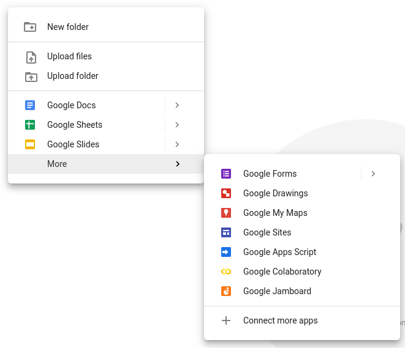

# Inteligência Computacional Aplicada
## Projeto 0

[](https://www.python.org/)
[](https://pandas.pydata.org/)
[](https://jupyter.org/)

[← Voltar](../README.md)

## Sumário

- [Objetivo](#objetivo)
- [Google Colab](#google-colaboratory)
- [UCI Repository](#uci-repository)
- [Como Submeter o Projeto](#como-submeter-o-projeto)
- [Ajuda](#ajuda)
- [Contatos](#contatos)

## Objetivo
Iniciar o aprendizado do Jupyter Notebooks no Google Colab.

## Google Colaboratory
O Google Colaboratory, carinhosamente chamado de **Colab**, é um serviço de nuvem gratuito hospedado pelo Google para incentivar a pesquisa de Aprendizado de Máquina e Inteligência Artificial.

É possível acessar o Colab diretamente pelo seguinte link https://colab.research.google.com/notebooks/intro.ipynb.

> É necessário possuir uma conta Google fara fazer uso da ferramenta

### Colab & Drive

Neste projeto e nos demais precisaremos conectar o Colab com o Google Drive. 

Para facilitar, crie uma pasta com esquema de diretórios na pasta **raíz** do seu Drive:

```
.                                 # Pasta raíz do Drive
├── IFCE_ICA_SEUNOME/             # Troque SEUNOME
│   │
│   ├── data/                     # Conjuntos de dados
│   ├── projetos/                 # Projetos
│   │   │
│   │   ├── projeto-0/            # Pasta deste projeto
│   │   └── ...
│   └── ...
└── ...
```

Dentro da pasta `projeto-0/` clique com o botão direito e crie um novo documento Colab. Caso o ícone não apareca, clique em *Conectar mais Apps* e conecte o Colab à sua conta.



### Ambiente de desenvolvimento

O Colab será o ambiente de desenvolvimento para esta disciplina. Dentre outras vantagens, a ferramenta disponibiliza GPUs para os processamentos de dados que devemos executar durante o decorrer da disciplina.

Na figura abaixo temos dois tipos de células de texto:
 - `+Code`: Onde escrevemos códigos em Python
 - `+Text`: Onde escrevemos textos em Markdown (leia mais na [Seção de Ajuda](#ajuda))


Adicione uma célula de texto e cole o conteúdo abaixo, preenchendo as informações do número do projeto, autor e turma.

```md
# Projeto: X
 - Autor: XXXX
 - Turma: XXXX

## Objetivo
Iniciar o aprendizado do Jupyter Notebooks no Google Colab.

## Desafio
Criar uma função chamada `perc(a,b)` que:
 - **Recebe**: 2 valores, `a` e `b`
 - **Retorna**: 2 valores, $\frac{a}{a+b}$ e $\frac{b}{a+b}$
```

Adicione uma célula de código e resolva o desafio acima. Teste a sua função em uma célula separada.

> Para executar as células de código use o comando `Ctrl+Enter` ou clique no símbolo de *play* ao lado da célula.


## UCI Repository

O UCI Machine Learning Repository é uma coletânia de conjuntos de dados usados pela comunidade que estuda aprendizado de máquina para testar e analizar o desempenho de algoritmos de aprendizagem. A plataforma é mantida pela Universidade da Califórina em Irvine.

É possível acessar o repositório por meio do link https://archive.ics.uci.edu/ml/index.php.

Preferencialmente usaremos dados desta plataforma em nossos experimentos.

Acesso o link acima e procure pelo conjunto de dados chamado **Breast Cancer Wisconsin**, clique em `Data Folder` e realize o download dos arquivo `breast-cancer-wisconsin.data` (que contém o conjunto de dados a ser estudado) e `breast-cancer-wisconsin.names` (que contém informações sobre o conjunto de dados).

> Renomei estes arquivos para `bcw`

Faça o upload dos arquivos na pasta `data/`. 

## Como submeter o Projeto

Compatilhe **o link da pasta** do projeto na tarefa do Google Salada de Aula relacionada a este projeto.

## Ajuda

- [Google Colab: o que é e como usar?](https://www.alura.com.br/artigos/google-colab-o-que-e-e-como-usar)
 - [Markdown para iniciantes](https://produtive.me/guia/markdown-um-guia-para-iniciantes/)

## Contatos

Em caso de dúvidas procure contato via:
 - Google Sala de Aula
 - Email Institucional

[↑ Topo](#inteligência-computacional-aplicada)